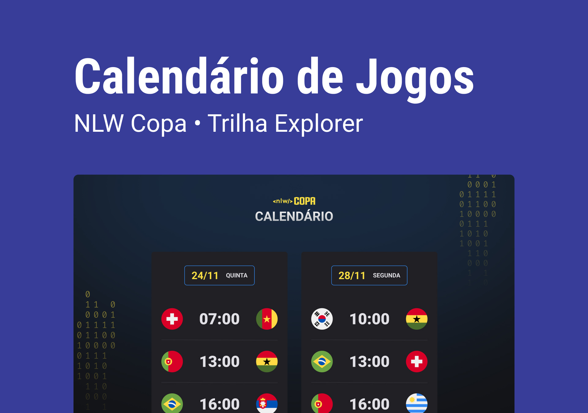

# Rocketseat - Next Level Week - World Cup 2022

This is a solution to the [NLW Copa](https://lp.rocketseat.com.br/nlw). The biggest free online development event in practice with lots of code, challenges, networking, and only one objective: Take you to the next level!

## Table of contents

- [Overview](#overview)
  - [The challenge](#the-challenge)
  - [Screenshot](#screenshot)
  - [Links](#links)
- [My process](#my-process)
  - [Built with](#built-with)
  - [What I learned](#what-i-learned)
  - [Continued development](#continued-development)
- [Author](#author)

## Overview

### The challenge

Users should be able to:

- View the optimal layout for the site depending on their device's screen size
- See hover states for all interactive elements on the page

### Screenshot



### Links

- Solution URL: [Github](https://github.com/allfigueiredodev/rocketseat-nlw-copa)
- Live Site URL: [GitHub Pages](https://allfigueiredodev.github.io/rocketseat-nlw-copa/)

## My process

### Built with

- HTML
- CSS
- Javascript
- Flexbox
- Mobile-first workflow
- Git
- Github

### What I learned

In this challenge, I learned how to handle animation in CSS using @keyframes.

```css
.card {
  opacity: 0;
  animation: appear .2s forwards;
}

@keyframes appear {
  0% {
    transform: translateY(-50px);
    opacity: 0;
  }

  100% {
    opacity: 1;
  }
}
```

### Continued development

I'll try to implement an API to feed the cards.

## Author

- Website - [allfigueiredodev](https://github.com/allfigueiredodev)
